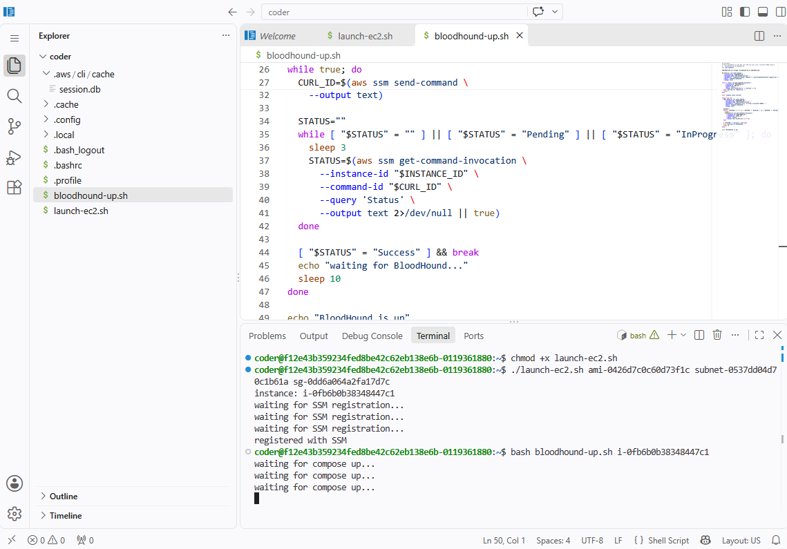

# ECS VS Code Proxy to EC2

> [!WARNING]
> **AI-authored:** This change was autonomously planned and implemented by an AI software factory from a human-authored specification, with possible subsequent human review or modification.

Tests a durable code-server workspace on ECS Fargate (behind a Cognito-authenticated ALB) that launches, drives and replaces disposable EC2 hosts over SSM only. The EC2 host runs BloodHound CE from a Packer-built AMI, and code-server's `/proxy/18080/` serves it through an SSM port forward.

## Notes

- reasonable/practical demonstration of the connectivity flow
- probably do not want provisioning of both orchestrators coming from the ACS instance itself
- relatively minor architectural complication
- does show that the connective pieces can be wired together cleanly
- possible model; controlled entry environment acting as a reviewer/control-panel space
- user dropped into tightly controlled environment
- from there; connect onward to target machines with constrained access
- target machines retain their own access controls
- could elevate the existing environment enough to allow tool installation where needed
- concern with code-server / VS Code model
- embedded capabilities/extensions/internals may create behaviours we are not fully aware of
- harder to reason about what needs to be restricted, monitored, or managed
- main question; how much trust/control to place in the interactive development surface itself
